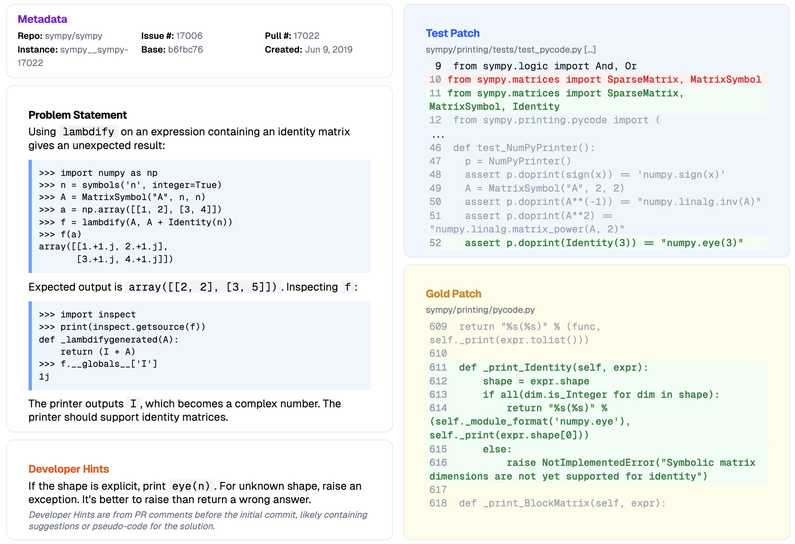
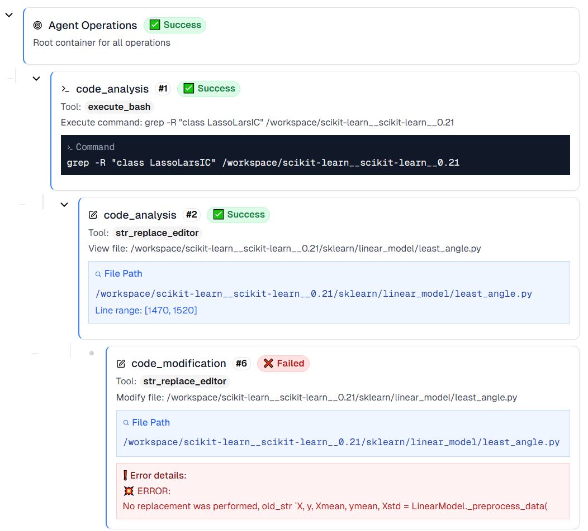
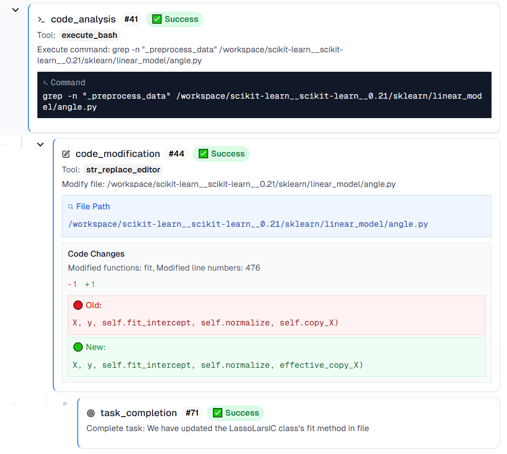

# SWE-bench Cognitive and Agent Behavior Analysis Toolkit

This repository contains datasets, annotations, and analysis scripts from our empirical study on cognitive capabilities and behavioral patterns of large language model (LLM) agents in software issue resolution. Our study is based on the [SWE-bench](https://huggingface.co/datasets/SWE-bench/SWE-bench) benchmark and its verified subset, and investigates the cognitive alignment between human and LLM judgments, the reliability of LLM confidence, and the behavioral trajectories of [Openhands](https://github.com/All-Hands-AI/OpenHands) agents.

Conceptual alignment between Cognitive Dimensions, Dataset, Research Questions (RQs), Observations, and Findings. 

Figure: Conceptual alignment between the **Cognitive Dimensions** and their corresponding **Roles in the Agent Workflow**. The upper layer represents the key cognitive dimensions investigated in this study, such as calibration, cues and heuristics, control, and monitoring, each describing a distinct aspect of meta-cognition in LLM agents. The lower layer maps these dimensions to their operational roles within the agent workflow (macro, input, process, feedback). The diagram also connects dataset annotation, research questions (RQ1–RQ4), empirical observations (O1–O7), and synthesized findings (F1–F4).

## 📘 Dataset Overview

We use the following datasets in our experiments:

- **SWE-bench**: A large-scale benchmark of 2,294 real-world GitHub issues from 12 popular Python repositories, including the full codebase, problem statements, and developer-provided patches.
- **SWE-bench-1699**: A subset of 1,699 issues from SWE-bench, annotated by OpenAI with three independent annotators
- **SWE-bench Verified**: A subset of 500 issues from SWE-bench, selected by OpenAI as high-quality, well-specified, and solvable.  

### Dataset Sources
- SWE-bench: [Hugging Face Dataset](https://huggingface.co/datasets/SWE-bench/SWE-bench)
- SWE-bench Verified: [OpenAI's Introduction](https://openai.com/index/introducing-swe-bench-verified/)
- OpenAI Original Annotation Instructions: [PDF](https://cdn.openai.com/introducing-swe-bench-verified/swe-b-annotation-instructions.pdf)
- SWE-bench-1699 Annotation Results: [ZIP](https://cdn.openai.com/introducing-swe-bench-verified/swe-bench-annotation-results.zip)

#### Each issue includes:
- **Problem Statement**: User-reported issue description.
- **Gold Patch**: Developer-submitted solution.
- **Test Patch**: Test added/modified to validate the fix.
- **Developer Hints**: Additional comments or clarifications by the developer (if available).

An example is shown below from the SWE-bench dataset. The **Problem Statement** describes the issue linked to a pull request (PR). The **Test Patch** defines the test case validating the fix, while the **Gold Patch** shows the actual code change (red: deletions, green: additions). **Developer Hints** are follow-up comments from developers.

## 🔍 Research Questions and Data

### RQ1: Investigating the Cognitive Gap  
We examine whether LLM agents demonstrate human-like cognitive behaviors when judging issue difficulty and specification quality.

- **Key Diagnostic Features**: We manually annotate each issue for the presence of critical cues in both the problem statement and developer hints.  
  ↳ [Annotation Data](https://github.com/Empirical2025/Empirical2025/blob/main/datasets/features_annotations.csv)

| Problem Statement | Developer Hints | Description                       |
|------------------|------------------|-----------------------------------|
| `r1-steps`       | `h1-steps`       | Reproduction steps / test cases   |
| `r2-stack`       | `h2-stack`       | Stack trace / error message       |
| `r3-code`        | `h3-code`        | Code snippet                      |
| `r4-media`       | `h4-media`       | Images or screenshots             |
| `r5-docs`        | —                | Documentation or external links   |

- **Explicit Cognitive Judgment**  
  LLMs are prompted to assess each issue based on OpenAI’s annotation schema, which includes:
  - **Problem Specification** (clarity and completeness)
  - **Task Difficulty**
  - **Confidence Level**  
  Code: [LLM-as-Judge Script](https://github.com/Empirical2025/Empirical2025/blob/main/scripts/llm_judge/LLM_as_judge_for_description_ablation.py)

- **Implicit Confidence Estimation**  
  We use a paraphrase-based uncertainty estimation method that measures **semantic eccentricity**, quantifying how variable the LLM’s answers are to semantically equivalent prompts. Greater variation implies lower internal confidence.  
  Code: [Eccentricity-Based Uncertainty Script](https://github.com/Empirical2025/Empirical2025/blob/main/scripts/uncertainty/uncertainty.py)

- **Outputs**
  - [Judgment Results](https://github.com/Empirical2025/Empirical2025/blob/main/judgements)
  - [Uncertainty Results](https://github.com/Empirical2025/Empirical2025/blob/main/datasets/uncertainty_values.csv)

### RQ2: Confidence Collapse under Input Alteration  
We test whether LLM judgments remain stable when key diagnostic information is altered.

- **Information Removal**: We remove specific cues (`r1-step`, `r2-stack`, or both) from the problem statement.  
- **Information Rephrasing**: We rewrite cues to be syntactically different but semantically equivalent.

Data:
- [Information Rephrasing/Removal Data](https://github.com/Empirical2025/Empirical2025/tree/main/datasets/SWE-bench_verified_ablation_descriptions)

### RQ3: Agent Trajectory Analysis  
We model and analyze the full decision process of agents during problem-solving.

#### Agent Operation Tree  
We represent each agent run as a hierarchical **Agent Operation Tree**, where each node captures a high-level operation:

- File Localization
- Thinking
- Code Analysis
- Code Modification
- Test Execution
- Task Completion

Each operation is extracted from tool logs and annotated with metadata such as success/failure status and file context. Rollbacks (switching focus to a different file after failed test/modification) are also captured.

  
  

#### Trajectory Feature Extraction  
We convert each operation tree into a fixed-length vector to enable quantitative analysis. Features capture behavior dimensions such as planning depth, loop patterns, and testing behavior.  

- **Code**: [Agent Trajectory Analysis Script](https://github.com/Empirical2025/Empirical2025/blob/main/scripts/traj_anlyze)
- **Data & Results**: [Agent Trajectories, Operation Trees, and Analysis Outputs](https://drive.google.com/drive/folders/1w2mq290GOqgESGmOPdQ4dkHGh-fTuzDD?usp=sharing) 

### RQ4: Toward Correction

We assess an LLM’s **meta-cognitive consistency** by re-evaluating its initial clarity and difficulty judgments **after** it has performed repair operations.

These assessments should, in principle, remain unchanged since a problem’s inherent clarity and difficulty are independent of the solution process. To test this, we provide the LLM with:
1. Its **original clarity and difficulty ratings**, along with justifications (from [LLM Judgment](#rq1-investigating-the-cognitive-gap)),
2. The corresponding **Agent Operation Tree** summarizing its repair steps (from [Trajectory Analysis](#rq3-agent-trajectory-analysis)),
3. The extracted **trajectory feature vector** that captures behavioral performance metrics (from [Trajectory Analysis](#rq3-agent-trajectory-analysis)).

The LLM-as-judge then outputs:
- **Revised Clarity and Difficulty Ratings**
- A **Bug-Fixing Score** (0 = no/incorrect fix, 1 = partial fix, 2 = complete fix), reflecting failure awareness [Aggarwal et al., 2025]
- A **100-word Summary** of its execution trajectory
- A **Binary Flag** indicating whether any critical trajectory issues occurred
- A **Brief Description of Potential Improvements**

These outputs allow us to assess **meta-cognitive consistency**, revealing how the LLM’s self-assessment adapts in light of its own actions.

- **Code**:  [LLM-as-Judge-with-traj Script](https://github.com/Empirical2025/Empirical2025/blob/main/scripts/llm_judge/LLM_as_judge_for_description_execution_ablation.py)

- **Output**: [LLM-as-Judge-with-traj Judgment Results](https://github.com/Empirical2025/Empirical2025/blob/main/judgements)

