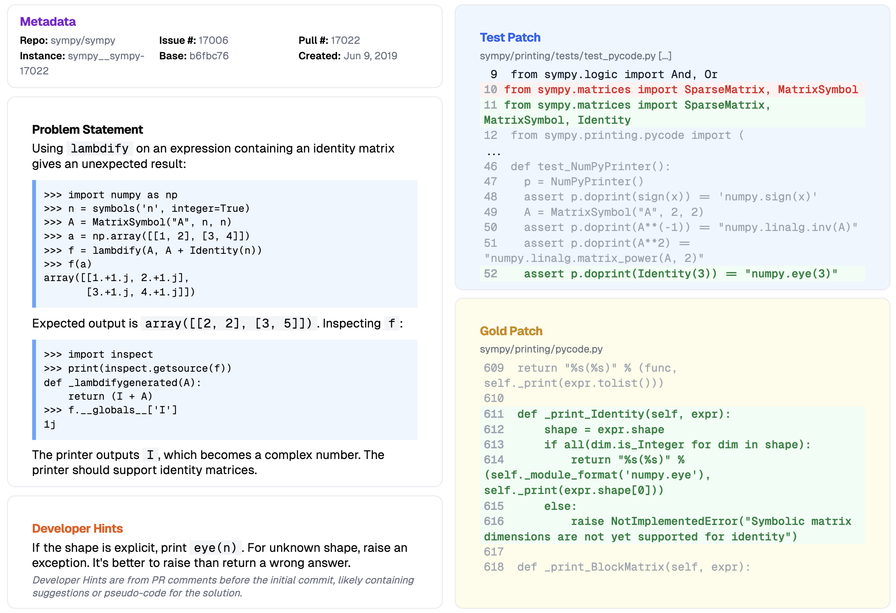
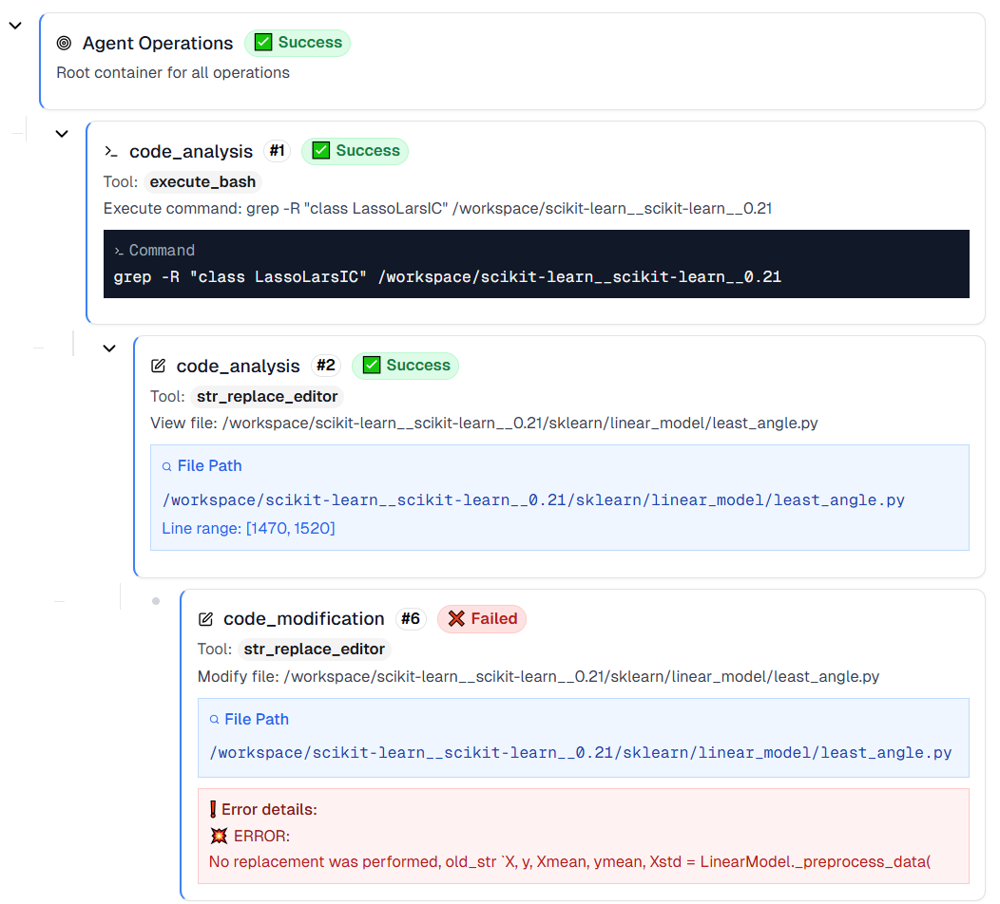
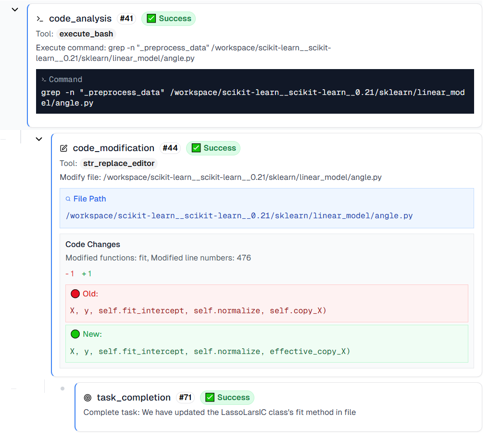

# Confidence vs. Competence: Agentic Software Repair Analysis Toolkit

This repository contains the datasets, annotations and analysis scripts associated with our empirical study:

> **Confidence vs. Competence: Misalignment in Judgment and Performance for Agentic Software Repair**
> Mingyue Yuan, Jieshan Chen, Dehai Zhao, Gelareh Mohammadi, Yoshifumi Kitamura, Aaron John Quigley, Qinghua Lu and Zhenchang Xing

<div align="center">

[](assets/TOSEM_agent_yuan26_confidence_vs_competence.pdf)

</div>

## 🎨 Research Findings at a Glance

<p align="center">
  
</p>

<p align="center">
  <em>
    An illustrated summary of the study's main findings: humans and agents may judge the same issue report differently; removing critical diagnostic cues can reduce repair success without producing a comparable change in the agent's self-assessment; longer or more active trajectories do not necessarily indicate effective progress; and post-execution judgments may conflict across different dimensions. These findings motivate repair systems that jointly monitor available evidence, agent behavior, and self-judgment, and trigger human intervention when autonomous repair becomes unreliable.
  </em>
</p>

Our study investigates two judgment-related gaps in agentic software repair:

1. the **human–agent judgment gap**, where LLM judgments of issue conditions differ from human judgments; and  
2. the **confidence–competence gap**, concerning whether agents' pre-execution self-assessments track their downstream repair success.

Using [SWE-bench](https://huggingface.co/datasets/SWE-bench/SWE-bench), controlled diagnostic-cue perturbations, and repair trajectories generated with [OpenHands](https://github.com/All-Hands-AI/OpenHands), we analyze how LLM agents:

- assess problem specification and task difficulty;
- respond when diagnostic information is removed or rephrased;
- change their execution, testing, and recovery behavior; and
- use post-execution self-judgment and behavioral evidence to detect likely repair failures.

All experimental materials are organized around four research questions covering **cue use, calibration, behavioral control, and post-execution monitoring**.


| RQ | Theoretical Perspective | Operational Measure |
|---|---|---|
| **RQ1** | **Cues and Heuristics:** cue utilization and judgment | **Problem Specification Informativeness and Judgment Alignment:** static cue association, dynamic developer follow-up, and information-gain analysis of **Problem Statements** and **Developer Hints**, together with human–LLM judgment alignment analysis using explicit rating distributions, implicit uncertainty signals, and Spearman correlation. |
| **RQ2** | **Calibration:** monitoring and self-assessment accuracy | **Pre-execution Confidence–Competence Alignment:** change-based alignment analysis between perturbation-induced shifts in pre-execution self-assessment and corresponding shifts in repair success, using Spearman correlation. |
| **RQ3** | **Control:** strategy adjustment under changing information conditions | **Behavioral Response to Input Perturbations:** trajectory-tree construction, behavioral feature extraction, and attribution analysis of repair trajectories under cue removal and rephrasing. |
| **RQ4** | **Monitoring:** signal detection and discriminability | **Toward Self-Judgment-Based Correction:** failure-detection and signal-discriminability analysis using post-execution self-judgment and observable trajectory evidence for completed repair attempts. |

**Table:** Mapping each research question to its theoretical perspective and corresponding operational measure. The four RQs align with successive problem-solving stages in agentic software repair: RQ1 focuses on recognizing input sufficiency, RQ2 on forming a calibrated pre-execution self-assessment of whether action is likely to succeed, RQ3 on observable behavioral responses as the task progresses under perturbed inputs, and RQ4 on post-execution monitoring signals for failure detection and correction.


## 📘 Dataset Overview

We use the following datasets in our experiments:

- **SWE-bench**: A large-scale benchmark of 2,294 real-world GitHub issues from 12 popular Python repositories, including the full codebase, problem statements, and developer-provided patches.
- **SWE-bench-1699**: A subset of 1,699 issues from SWE-bench, annotated by OpenAI with three independent annotators
- **SWE-bench Verified**: A subset of 500 issues from SWE-bench, selected by OpenAI as high-quality, well-specified, and solvable.  

Our analyses use the first two dimensions. The human confidence rating is not used because it is subjective and may vary across annotators.

### Dataset Sources
- SWE-bench: [Hugging Face Dataset](https://huggingface.co/datasets/SWE-bench/SWE-bench)
- SWE-bench Verified: [OpenAI's Introduction](https://openai.com/index/introducing-swe-bench-verified/)
- OpenAI Original Annotation Instructions: [PDF](https://cdn.openai.com/introducing-swe-bench-verified/swe-b-annotation-instructions.pdf)
- SWE-bench-1699 Annotation Results: [ZIP](https://cdn.openai.com/introducing-swe-bench-verified/swe-bench-annotation-results.zip)


#### Each issue includes:
- **Problem Statement:** the initial user-reported issue description;
- **Developer Hints:** subsequent diagnostic information or clarification from developers or maintainers;
- **Gold Patch:** the developer-submitted reference solution; and
- **Test Patch:** tests added or modified to validate the solution.

An example is shown below from the SWE-bench dataset. The **Problem Statement** describes the issue linked to a pull request (PR). The **Test Patch** defines the test case validating the fix, while the **Gold Patch** shows the actual code change (red: deletions, green: additions). **Developer Hints** are follow-up comments from developers.




## 🔍 Research Questions and Repository Materials

## RQ1: Problem Specification Informativeness and Judgment Alignment

**How informative are the Problem Statement and subsequent Developer Hints for assessing issue specification, and do LLM judgments align with human ratings and human-valued diagnostic cues?**

RQ1 studies issue-report informativeness from both the human and LLM perspectives.

### Diagnostic-Cue Annotation

We manually annotate diagnostic cues in both the initial **Problem Statement** and subsequent **Developer Hints**.

| Problem Statement | Developer Hints | Description                       |
|------------------|------------------|-----------------------------------|
| `r1-steps`       | `h1-steps`       | Reproduction steps / test cases   |
| `r2-stack`       | `h2-stack`       | Stack trace / error message       |
| `r3-code`        | `h3-code`        | Code snippet                      |
| `r4-media`       | `h4-media`       | Images or screenshots             |
| `r5-docs`        | —                | Documentation or external links   |

Across the 1,699 annotated reports, the two annotators disagreed on 129 reports, corresponding to a disagreement rate of 7.5%. Cohen's Kappa was 0.85.

- **Annotation data:** [`datasets/features_annotations.csv`](datasets/features_annotations.csv)
- **Annotation schema:** see the paper appendix and the annotation files in [`datasets/`](datasets/)

### Information-Gain Analysis

We quantify how much specification-relevant information is provided by diagnostic cues in the initial **Problem Statement** and how much additional information is contributed by subsequent **Developer Hints**.

The analysis uses cross-validated logistic regression to estimate:

- the aggregate informativeness of report-side cues;

- the incremental informativeness of developer follow-up; and

- the contribution of each individual diagnostic cue.

The results show that cues in the initial Problem Statement provide limited information about issue specification, whereas Developer Hints contribute substantially more incremental information.

### Explicit LLM Judgment

We prompt LLM judges using the same annotation schema provided to human annotators. Each model assesses:

- **Problem Specification**
- **Task Difficulty**
- **Confidence Level**.

Randomized-order prompting is repeated three times to reduce positional bias.

The evaluated judges include:

- Claude Sonnet 4;
- GPT-4.1; and
- o4-mini.

- **LLM-as-Judge scripts:** [`scripts/llm_judge/`](scripts/llm_judge/)
- **Judgment outputs:** [`judgements/`](judgements/)

### Implicit Uncertainty Signal

We estimate black-box uncertainty through response stability under semantically equivalent inputs.

For each Problem Statement, we generate five meaning-preserving paraphrases and calculate **semantic eccentricity**, which measures deviation from the semantic consensus among model responses.

Higher eccentricity indicates less stable judgment and therefore greater implicit uncertainty.

- **Uncertainty analysis:** [`scripts/uncertainty/`](scripts/uncertainty/)


### Human–LLM Judgment Alignment
We compare LLM and human ratings of **Problem Specification** and **Task Difficulty** using rank-correlation analysis.

The results show consistently weaker human–LLM agreement for Problem Specification than for Task Difficulty.


## RQ2: Pre-execution Confidence–Competence Alignment

**Under controlled cue perturbations, do changes in an agent's pre-execution self-assessment track corresponding changes in repair success?**

RQ2 investigates whether changes in self-assessment reflect changes in realized repair competence.

### Terminology

- **Pre-execution self-assessment** refers to the model's raw Problem Specification and Task Difficulty ratings before generating or executing a candidate fix.
- **Pre-execution confidence** refers to an operational confidence score derived from these ratings.
- **Competence** refers to realized repair success under the official SWE-bench evaluation.
- **Alignment** refers to whether changes in self-assessment track changes in repair success.

### Controlled Perturbation Dataset

We identify **146 SWE-bench Verified issues** containing both:

- reproduction steps (`r1-steps`); and
- stack traces or error messages (`r2-stack`).

For each original issue, we define three target cue sets:

1. reproduction steps only;
2. stack traces only; 
3. both reproduction steps and stack traces.


We apply two intervention types:

- **Information Removal:** removes the selected diagnostic cue or cues;
- **Information Rephrasing:** changes surface wording while preserving semantic content.

This produces six controlled variants per issue:

| Target Cue Set | Removal | Rephrasing |
|---|---:|---:|
| Reproduction steps | ✓ | ✓ |
| Stack trace | ✓ | ✓ |
| Both cues | ✓ | ✓ |

- **Perturbed issue reports:** [`datasets/SWE-bench_verified_ablation_descriptions/`](datasets/SWE-bench_verified_ablation_descriptions/)

### Repair-Success Analysis

We compare official SWE-bench repair outcomes across the original and perturbed inputs.
The strongest degradation is observed when both reproduction steps and stack traces are removed, showing that these human-valued diagnostic cues materially affect agent repair competence.

### Change-Based Alignment

We compare each perturbed issue with its original version to examine whether changes in pre-execution self-assessment reflect corresponding changes in repair success.
The analysis considers changes in:

- **Problem Specification** ratings;
- **Task Difficulty** ratings; and
- official SWE-bench repair outcomes.

Rank-correlation analysis is used to measure whether self-assessment shifts move consistently with performance degradation.
The results show that pre-execution self-assessment changes only weakly track perturbation-induced repair degradation.


## RQ3: Behavioral Response to Input Perturbations

**How do repair trajectories change when diagnostic cues are removed or rephrased, and do these changes correspond to productive or unproductive behavioral response?**

RQ3 examines observable changes in agent behavior rather than relying only on final repair outcomes.

### Repair Trajectory

A **repair trajectory** is the observable sequence of high-level operations performed during one issue-resolution attempt, from localization and code inspection to modification, testing, recovery, and termination.

All trajectories are generated using the OpenHands scaffold. Therefore, the extracted features represent behavior of the complete model–scaffold system rather than direct evidence of model-internal strategy.

### Agent Operation Tree

Each repair trajectory is represented as a hierarchical **Agent Operation Tree**.

The tree contains six high-level operation categories:

- **File Localization**
- **Thinking**
- **Code Analysis**
- **Code Modification**
- **Test Execution**
- **Task Completion**

A **rollback** is defined as a transition from a test execution or code modification on one file to subsequent code analysis on a different file.

<div align="center">
  
  
</div>

### Trajectory Feature Extraction

Each Agent Operation Tree is converted into a fixed-dimensional behavioral feature representation.

The feature schema is identical for every trajectory. Differences between trajectories are represented by changes in feature values, not changes in vector dimensionality.

| Dimension | Representative Features |
|---|---|
| Overall efficiency | `total_cost`, `total_rounds`, `total_executions`, `longest_path_length` |
| Error handling | `failed_executions`, `failure_exe_repair_count`, `rollback_count` |
| Modification behavior | `modification_attempts` |
| Testing behavior | `test_execution_count`, `last_test_success`, `test_before_code_mod`, `test_only_after_code_mod`, `test_between_code_mod` |

### Outcome-Association Analysis

We fit an interpretable logistic regression model to examine which trajectory features are associated with repair success.

The coefficients are interpreted as associations rather than causal effects.

The analysis distinguishes:

- **productive behavior**, such as targeted testing and rollback; from
- **unproductive effort**, such as long or repetitive execution trajectories.


#### Trajectory Feature Extraction  
We convert each operation tree into a fixed-length vector to enable quantitative analysis. Features capture behavior dimensions such as planning depth, loop patterns, and testing behavior.  

- **Trajectory analysis scripts:** [`scripts/traj_anlyze/`](scripts/traj_anlyze/)


## RQ4: Toward Self-Judgment-Based Correction

**Can post-execution self-judgment and observable trajectory evidence discriminate successful from failed repair attempts as complementary validation signals?**

RQ4 frames correction as a **post-execution monitoring** problem.

After an agent produces a candidate patch and completes its trajectory, we examine whether self-judgment and behavioral evidence can help determine whether the repair attempt should be:

- accepted;
- further validated; 
- revised.

### Post-execution Self-Judgment

The **Post-execution Self-Judgment (PSJ)** module receives:

1. the agent's original Problem Specification and Task Difficulty ratings and their justifications;
2. the Agent Operation Tree summarizing the completed repair attempt; and
3. the extracted trajectory feature vector.

The PSJ module produces:

- revised Problem Specification and Task Difficulty ratings;
- a **bug-fixing score**:
  - `0`: no fix or incorrect fix;
  - `1`: partial fix;
  - `2`: complete fix;
- a short trajectory summary;
- a binary flag indicating critical trajectory issues; and
- suggested improvements.

- **PSJ scripts:** [`scripts/llm_judge/LLM_as_judge_for_description_execution_ablation.py`](scripts/llm_judge/LLM_as_judge_for_description_execution_ablation.py)


### Cross-Dimension PSJ Analysis

We examine how self-assessment changes after the model observes its own repair trajectory.

The results show an internally divergent pattern:

- Problem Specification is often revised upward;
- Task Difficulty is often revised downward; while
- confidence declines.

This inconsistency suggests that useful monitoring information may arise from disagreement across PSJ dimensions rather than from any single revised score.

### Failure-Detection Models

We compare three settings:

1. **PSJ features only**;
2. **behavioral trajectory features only**; and
3. **behavioral and PSJ features combined**.

Failure detection is evaluated against the official SWE-bench outcome using area under the ROC curve, The results show that PSJ is weak as a stand-alone failure detector, but adds complementary discriminative information when combined with behavioral trajectory evidence.

| Method | AUC | Accuracy | Precision | Recall |
|---|---:|---:|---:|---:|
| PSJ features only | 0.61 | 0.59 | 0.63 | 0.68 |
| Behavioral features only | 0.70 | 0.75 | 0.73 | 0.75 |
| Behavioral + PSJ features | 0.74 | 0.77 | 0.77 | 0.77 |

These results support the use of post-execution self-judgment as an **auxiliary validation signal**, rather than as a stand-alone decision mechanism.


---

## 🤖 Models and Agent Scaffold

We evaluate three LLM families:

- **Claude Sonnet 4**
- **GPT-4.1**
- **o4-mini**

The experiments use [OpenHands](https://github.com/All-Hands-AI/OpenHands) as the agent scaffold.

OpenHands supports:

- repository exploration;
- file inspection;
- code editing;
- command execution;
- test execution; and
- iterative interaction with execution outputs.

The objective of this repository is not to optimize SWE-bench leaderboard performance. Instead, it provides a reproducible toolkit for analyzing judgment, confidence–competence alignment, trajectory-level behavior, and post-execution failure signals in agentic software repair.

---


## 📖 Citation

If you use this repository, please cite our paper:

```bibtex
@article{yuan2026confidence,
  title   = {Confidence vs. Competence: Misalignment in Judgment and Performance for Agentic Software Repair},
  author  = {Mingyue Yuan and Jieshan Chen and Dehai Zhao and Gelareh Mohammadi and Yoshifumi Kitamura and Aaron John Quigley and Qinghua Lu and Zhenchang Xing},
  journal = {ACM Transactions on Software Engineering and Methodology},
  year    = {2026}
}
```
